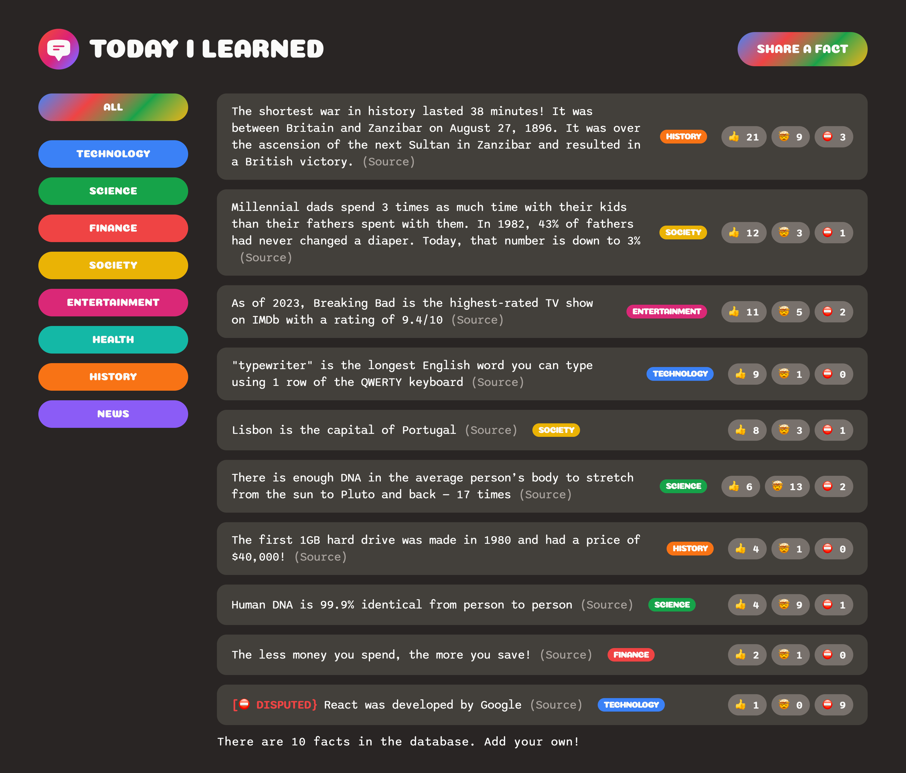

# Crash Course: Build a Full-Stack Web App in a Weekend!

- Today I Learned
- Instructor: Jonas Schmedtmann

## Table of contents

- [Overview](#overview)
  - [The challenge](#the-challenge)
  - [Screenshot](#screenshot)
  - [Links](#links)
- [My process](#my-process)
  - [Built with](#built-with)
  - [What I learned](#what-i-learned)
  - [Continued development](#continued-development)
  - [Useful resources](#useful-resources)
- [Author](#author)
- [Acknowledgments](#acknowledgments)

## Overview

### The challenge

Users should be able to:

- Users should be able to create a form by using a share-a-fact button
- Users should be able to type text, paste the URL and choose the options from the category list
- Users should be able to post the form and check the result in the forum container
- Users should be able to sort the categories by category
- Users should be able to vote on the 3 buttons

### Screenshot

### Links

- Solution URL: [Github](https://github.com/bbenbboy/11.pricing-component.git)
- Live Site URL: [Live Site](https://todayilearned-ratchapon.netlify.app/)

## My process

### Built with

- Semantic HTML5 markup
- CSS custom properties
- Flexbox
- CSS Grid
- Mobile-first workflow
- React

### What I learned

None

### Continued development

None

### Useful resources

None

## Author

- Website - [My Resume](https://ratchapon-portfolio.notion.site/Hi-welcome-to-my-portfolio-f45d1ec329d54dac9cd9bf8c217a3f01)
- Frontend Mentor - [@bbenbboy](https://www.frontendmentor.io/profile/bbenbboy)

## Acknowledgments

None
